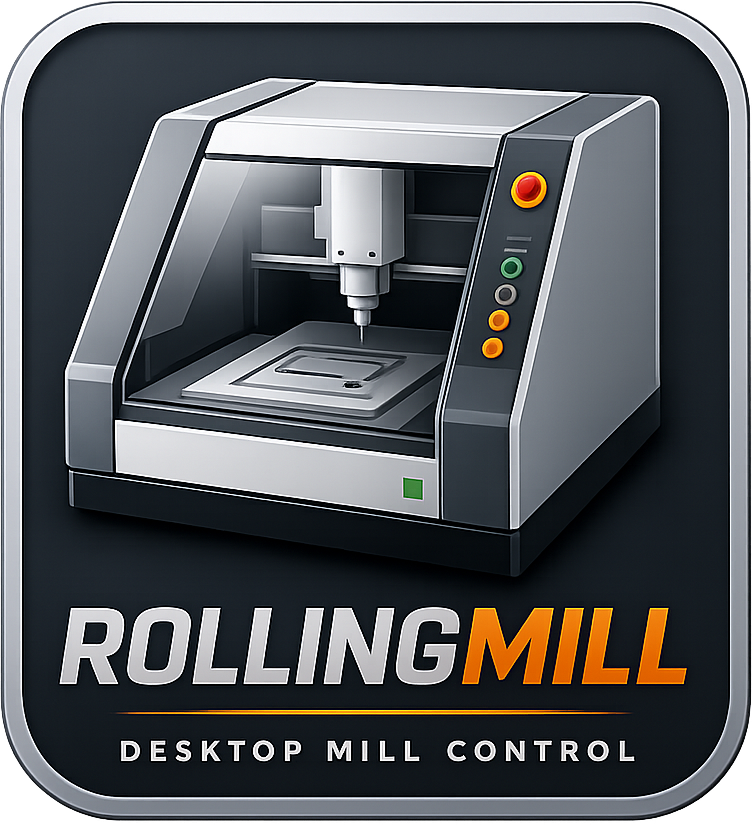

RollingMill
======

Open-source USB control stack for Roland DG MDX-series desktop mills.

RollingMill communicates directly with the machine over libusb, replacing both the proprietary Windows kernel driver and the VPanel control application.

The project currently provides:

* Live machine state monitoring
* Axis position readback
* Variable speed Jogging
* Spindle control and Rotary Axis Drilling mode
* Interactive terminal UI (TUI)
* Cross-platform support (Linux, macOS, Windows)

Reverse Engineering
------
The MDX USB protocol was reverse engineered from the official Windows driver stack using Ghidra analysis and protocol inspection. See [the protocol documentation](docs/).

The official Windows stack consists of:

* RD25D — kernel-mode USB driver
* VPanel — user-space control application

RollingMill implements both layers in pure Python.

ZCL-40A 4th Axis
----
When this unit is installed, the X-, Y-, and Z-axis travel of the MDX-40A is reduced:

| Axis | MDX-40A     | MDX-40A + ZCL-40A      |
|------|-------------|------------------------|
| X    | 0 → 305 mm  | 34 → 305 mm            |
| Y    | 0 → 305 mm  | 0 → 305 mm             |
| Z    | 0 → −105 mm | 0 → −68 mm             |
| A    | —           | 0 → 360° (continuous)  |

These limits are enforced in firmware, including from the physical jog controls on the machine itself.
